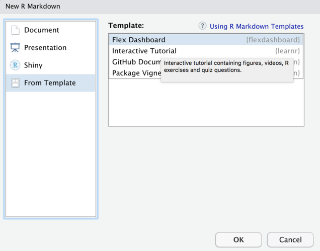

<style>
body {
text-align: justify}
</style>

```{r setup, include=FALSE}
# learnr
library(learnr)
knitr::opts_chunk$set(echo = TRUE)
options(scipen = 99)
Sys.setlocale('LC_ALL','C')
library(sortable)
library(parsons)

# Data Wrangling
library(tidyverse)
library(lubridate)

# Visualisasi
library(ggplot2)
library(plotly)
library(glue)
library(scales)

library(googlesheets)
```

## Bab 1: Pendahuluan

Halo <i>future Data Scientist</i>! Jika pada <i>course</i> minggu lalu kita sudah mempelajari bagaimana membuat sebuah visualiasi statis dengan menggunakan bantuan `library(ggplot2)`, pada <i>course</i> minggu ini kita akan mempelajari bagaimana mengtransformasi visualisasi yang statis menjadi sebuah visualisasi yang interaktif.   

Apa itu visualisasi yang interaktif? Visualisasi interaktif merupakan sebuah visualisasi yang memungkinkan penggunanya untuk melakukan interaksi terhadap visualisasi dan visualisasinya akan memberikan hasil atau respon sesuai dengan interaksi yang diberikan, salah satu contoh interaksi sederhana yang bisa kita lakukan adalah mengarahkan kursor ke salah satu bagian plot dan pada bagian plot tersebut akan mengeluarkan sebuah informasi. 

<center>

</center>

<br>

Harapannya dengan adanya visualisasi yang interaktif seperti GIF di atas, kita bisa menyampaikan data yang kompleks dan berukuran besar dengan metode yang lebih menarik terhadap lawan bicara.

Pada <i>course</i> ini, kita tidak hanya mempelajari bagaimana membuat sebuah visualisasi interaktif, melainkan kita akan memulai <i>course</i> dengan mendalami bagaimana mempersiapkan data kita dengan bantuan sebuah <i>library</i> dan dibagian akhir kita akan mencoba untuk berkenalan sekaligus mendalami bagaimana kita bisa menyajikan visualisasi interaktif ke sebuah <i>dashboard</i>

## Bab 2: Persiapan Data

Sebelum melakukan sebuah visualisasi, salah satu tahapan yang tidak boleh terlewat adalah tahapan persiapan data. Seperti yang disampaikan sebelumnya, tahapan persiapan data kita kali ini akan memanfaatkan beberapa fungsi dari sebuah library yang bernama `dplyr`. Fungsi-fungsi dari `library(dplyr)` juga sudah didokumentasikan oleh R ke dalam sebuah <i>cheatsheet</i> yang bisa diakses melalui link berikut ini [RStudio Cheatsheet](https://www.rstudio.com/resources/cheatsheets/).

Data yang akan kita coba persiapkan untuk kita buat visualisasinya adalah data mengenai barang-barang IKEA Swedia, yang sudah disimpan kedalam sebuah objek yang bernama `ikea`

```{r echo=FALSE, results='hide', message=FALSE, warning=FALSE}
ikea <- read.csv("data_input/ikea.csv")

ikea <- ikea %>% 
  select(-X, -link, -short_description, -name, -old_price) %>% 
  na.omit() %>% 
  separate_rows(designer, sep = "/") %>% 
  filter(designer %in% c("IKEA of Sweden", "Karl Malmvall", "J Karlsson", "N Karlsson", "Francis Cayouette", "Ola Wihlborg", "Marcus Arvonen", "Nike Karlsson", "K Hagberg", "M Hagberg", "Jonas Hultqvist", "Ebba Strandmark", "Carina Bengs", "L Hilland	", "Fredriksson","David Wahl", "John", "Jonas", "Caroline", "Paul", "Petrus", "Hilland", "Chris Martin" ))
```

```{r echo=FALSE}
ikea
```

Keterangan:

* `item_id`: Item ID dari setiap furniture
* `category`: Kategori dari furniture (sofa, bed, chairs, trolley, dll) 
* `price`: Harga dari website per tanggal 20 April 2020
* `sellable_online`: Apakah barang tersebut juga dijual di online? (True/False)
* `other_colors`: Apakah barang tersebut memiliki warna lain dari warna barang yang dipajang? (Yes/No)
* `designer`: Nama designer yang membuat barang tersebut
* `width`: Lebar barang dalam centimeter
* `height`: Tinggi barang dalam centimeter
* `depth`: Panjang barang dalam centimeter

### 2.1 Subset Data

Subset data merupakan salah satu teknik dalam persiapan data yang paling sering dilakukan, pada proses subset data kita akan mengambil sebagian data berdasarkan kebutuhan atau kondisi tertentu. Untuk lebih memahami bagaimana melakukan subset data dengan menggunakan fungsi dari `library(dplyr)` dan melihat perbedaannya dengan cara base, mari kita coba latihan dengan menggunakan objek `ikea`!

<b>Latihan Subset Data 1:</b> 

Dari data ikea ambil kolom `designer`, `category`, dan `price`.

```{r}
# Cara base
ikea[ , c("designer","category","price")]
```

Jika kita menggunakan cara base, kita bisa melakukan subset data dengan menggunakan cara di atas. Sekarang mari kita coba untuk melakukan subset data dengan menggunakan cara dplyr.

```{r lat1, exercise = TRUE, exercise.eval = TRUE}
# Cara dplyr

```

<b>Latihan Subset Data 2:</b> 

Dari data ikea ambil data yang memiliki category `Tables & desks` dan `Bar furniture`.

```{r}
# Cara base
ikea[ikea$category %in% c("Tables & desks", "Bar furniture"),  ]
```

Dalam melakukan subset data dengan kondisi tertenu kita bisa memanfaatkan cara base di atas. Sekarang mari kita coba untuk melakukan subset dengan kondisi tertentu dengan menggunakan cara dplyr. 

```{r lat2, exercise = TRUE, exercise.eval = TRUE}
# Cara dplyr

```

<b>Latihan Subset Data 3:</b> 

Mari kita coba gabungkan subseting data dengan menggabungkan kedua proses sebelumnya menjadi satu proses.

```{r}
# Cara base
ikea[ikea$category %in% c("Tables & desks", "Bar furniture"), c("designer","category","price")]
```

Jika dengan menggunakan cara base kita bisa menggabungkan kedua proses subset data sebelumnya kedalam satu proses, sekarang mari kita coba dengan menggunakan cara dplyr.

```{r lat3, exercise = TRUE, exercise.eval = TRUE}
# Cara dplyr

```

### 2.2 Feature Engineering

<i>Feature engineering</i> merupakan sebuah teknik persiapan data, dimana kita bisa membuat sebuah kolom baru ataupun menghilangkan sebuah kolom berdasarkan kebutuhan bisnis. Selain membuat atau menghilangkan kolom, pada bagian <i>feature engineering</i> ini, kita juga bisa melakukan transformasi atau modifikasi pada data yang sudah ada. 

<b>Latihan Feature Engineering 1:</b> 

Pada kolom `price` harga untuk setiap barangnya masih dalam mata uang Saudi Riyal, agar kita mengetahui berapa harga barang tersebut dalam mata uang Indonesia, mari kita coba tambahkan sebuah kolom baru yang berisikan informasi harga barang tersebut dalam mata uang Indonesia (1 Saudi Riyal = Rp 3817,76).

```{r}
# Cara base
ikea$price_in_rp <- ikea$price * 3817.76
head(ikea)
```

Seperti yang kita sudah ketahui kita bisa menggunakan cara base seperti chunk di atas untuk menambahkan sebuah kolom baru, mari sekarang kita coba menambahkan kolom baru yang berisikan informasi harga barang dalam mata uang Indonesia dengan menggunakan cara dplyr.

```{r lat4, echo=FALSE}
question("Coba pilih salah satu kode dplyr dibawah ini yang dapat digunakan untuk membuat kolom baru yang berisikan informasi harga barang dalam mata uang Indonesia.", type = "single",
correct = "Selamat jawabannya sudah benar!", incorrect = "Ups, Salah!", allow_retry = TRUE,
random_answer_order = FALSE,
answer("ikea <- ikea %>% mutate(price = price * 3817.76)"),
answer("ikea <- ikea %>% mutate(price_in_rp = price * 3817.76)", correct = TRUE),
answer("ikea <- ikea %>% select(price_in_rp = price * 3817.76)"))
```

<b>Latihan Feature Engineering 2:</b> 

Pada tahapan ini kita juga bisa melakukan transformasi atau modifikasi pada data yang sudah ada. Transformasi atau modifikasi yang paling sederhana yang bisa kita lakukan adalah mengubah tipe data pada kolom-kolom yang belum memiliki tipe data yang sesuai.

```{r}
# Cara base
ikea[ , c("category", "sellable_online", "other_colors", "designer")] <- lapply(ikea[ , c("category", "sellable_online", "other_colors", "designer")], as.factor)
glimpse(ikea)
```

Selain menggunakan fungsi lapply untuk mengubah tipe data pada beberapa kolom secara bersamaan, kita juga bisa memanfaatkan salah satu fungsi dari `library(dplyr)`. Sekarang mari kita coba untuk mengubah beberapa kolom secara bersamaan tanpa menggunakan cara base.

```{r lat5, echo=FALSE}
question("Coba pilih salah satu kode dplyr dibawah ini yang dapat digunakan untuk mengubah beberapa kolom secara bersamaan.", type = "single",
correct = "Selamat jawabannya sudah benar!", incorrect = "Ups, Salah!", allow_retry = TRUE,
random_answer_order = FALSE,
answer("ikea <- ikea %>% mutate_if(is.character, as.factor)", correct = TRUE),
answer("ikea <- ikea %>% transmute(is.character, as.factor)"),
answer("ikea <- ikea %>% mutate(category = as.factor(category))"))
```

### 2.3 Aggregasi Data

Teknik lain yang sering digunakan pada data wrangling yaitu aggregasi data, pada proses ini kita bisa melakukan perhitungan untuk beberapa nilai berdasarkan pengelompokan tertentu.

<b>Latihan Aggregasi Data 1:</b>

Dalam latihan aggregasi data ini, kita akan mencoba untuk menghitung rata rata harga untuk setiap category.

```{r}
# Cara base
aggregate(x = ikea$price,
          by = list(ikea$category),
          FUN = mean)
```

Jika dengan cara base kita bisa menggunakan fungsi `aggregate()` untuk melakukan aggregasi, sekarang mari kita coba untuk melakukan aggregasi data dengan menggunakan cara dplyr.

```{r lat6, exercise = TRUE, exercise.eval = TRUE}
# Cara dplyr

```

Setelah kita melakukan aggregasi, hasil aggregasinya masih belum terurut secara rapi dari nilai yang paling tertinggi ke nilai terendah ataupun sebaliknya. 

```{r lat7, echo=FALSE}
question("Coba pilih salah satu fungsi dplyr dibawah ini yang dapat membantu kita untuk mengurutkan hasil aggregasi data yang sudah dilakukan.", type = "single",
correct = "Selamat jawabannya sudah benar!", incorrect = "Ups, Salah!", allow_retry = TRUE,
random_answer_order = FALSE,
answer("slice()"),
answer("pull()"),
answer("arrange()", correct = TRUE))
```

## Bab 3: Visualisasi Interaktif

Pada bagian ini kita akan mencoba untuk mendalami bagaimana mengtransformasi visualisasi yang statis menjadi sebuah visualisasi yang interaktif. Dalam proses transformasi tersebut kita akan dibantu dengan dua library yaitu `library(plotly)` dan `library(glue)`. 

* `Library(plotly)`: Library `plotly` adalah API dari R untuk visualisasi interaktif milik `plotly.js`. Sebagai pengguna R, kita **dimudahkan** oleh satu fitur penting `plotly` untuk membuat plotting interaktif dari objek ggplot yaitu fungsi `ggplotly()`.
* `Library(glue)`: Library `glue` memiliki sebuah fungsi yang memungkinkan kita untuk menampilkan sebuah informasi yang kita inginkan ketika meletakan cursor ke tiap bar/poin/element lain pada visualisasi.

Dengan bantuan kedua library tersebut nantinya kita akan mencoba untuk membuat visualisasi yang interaktif dari objek `ikea_clean`.

```{r echo=FALSE, results='hide', message=FALSE, warning=FALSE}
ikea_clean <- ikea %>% 
  mutate_if(is.character, as.factor) %>% 
  mutate(price_in_rp = price * 3817.76)
```

```{r}
ikea_clean
```

<b>Latihan Visualisasi Interaktif 1:</b>

Untuk mendalami visualisasi interaktif cobalah untuk mereplikasi visualisasi interaktif dibawah ini. Pada visualisasi dibawah ini ingin menampilkan top 10 designer yang paling banyak membuat produk di IKEA.

```{r echo=FALSE, message=FALSE, warning=FALSE}
df <-
  ikea_clean %>%
  select(designer) %>%
  separate_rows(designer, sep = "/") %>%
  group_by(designer) %>%
  summarise(freq = n()) %>%
  arrange(-freq) %>%
  head(10)

# buat plot
plot <- ggplot(data  = df, aes(
  x = freq,
  y = reorder(designer, freq),
  text = glue("Total items: {freq}")
)) +
  geom_col(fill = "dodgerblue3") +
  labs(title = "Top 10 Designer Based On Total Products",
       x = "Frequency",
       y = "Designer") +
  scale_y_discrete(
    labels = function(x)
      str_wrap(x, width = 10)
  ) +
  theme_minimal()

# ggplotly
ggplotly(plot, tooltip = "text")
```

Untuk mempermudah proses replikasi visualisasi di atas, mari kita coba urutkan terlebih dahulu fungsi-fungsi yang sudah disediakan di bawah ini.

* <b>Aggregasi Data</b>

```{r lat8, echo=FALSE}
question_parsons(
  initial = c(
    "labs(...)",
    "tail(...)",
    "head(...)",
    "aggregate(...)",
    "ikea_clean",
    "group_by(...)",
    "desc(...)",
    "arrange(...)",
    "summarise(...)"
  ),
  pass_if(
    c(
      "ikea_clean",
      "group_by(...)",
      "summarise(...)",
      "arrange(...)",
      "head(...)"
    )
  ),
  
  fail_if(
    ~length(.) < 5,
    message = "Include five answers"
  ),
  
  fail_if(
    function(x){"labs(...)" %in% x},
    message = "You should not include labs(...) in your answer"
  ),
  
    fail_if(
    function(x){"tail(...)" %in% x},
    message = "You should not include tail(...) in your answer"
  ),
  
    fail_if(
    function(x){"desc(...)" %in% x},
    message = "You should not include desc(...) in your answer"
  ),
  
  fail_if(
    function(x){"aggregate(...)" %in% x},
    message = "You should not include aggregate(...) in your answer"
  )
)
```

* <b>Visualisasi</b> 

```{r lat9, echo=FALSE}
question_parsons(
  initial = c(
    "labs()",
    "ggplot(data  = , aes(x = , y = reorder( , ), text = glue( )))",
    "geom_col(fill = )",
    "ggplotly()",
    "geom_segment(fill = )",
    "arrange()",
    "theme_minimal()",
    "ggplotly( , tooltip = )"
  ),
  pass_if(
    c(
      "ggplot(data  = , aes(x = , y = reorder( , ), text = glue( )))",
      "geom_col(fill = )",
      "labs()",
      "theme_minimal()",
      "ggplotly( , tooltip = )"
    )
  ),
  
  fail_if(
    ~length(.) < 5,
    message = "Include five answers"
  ),
  
  fail_if(
    function(x){"geom_segment(fill = ...)" %in% x},
    message = "You should not include geom_segment(fill = ...)in your answer"
  ),
  
    fail_if(
    function(x){"arrange(...)" %in% x},
    message = "You should not include arrange(...) in your answer"
  ),
  
  fail_if(
    function(x){"ggplotly(...)" %in% x},
    message = "You should not include ggplotly(...) in your answer"
  )
)
```

Setelah berhasil mengurutkan dengan benar setiap fungsi yang akan digunakan dari tahapan aggregasi data sampai visualisasi, mari kita coba isi setiap parameter yang dibutuhkan untuk menghasilkan visualisasi interaktif yang sama seperti diatas.

```{r lat10, exercise = TRUE, exercise.eval = TRUE}


```

<b>Latihan Visualisasi Interaktif 2:</b>

Untuk lebih mendalami visualisasi interaktif, mari kita coba replikasi satu visualisasi lagi. Pada visualisasi dibawah kita diminta untuk membuat sebuah visualiasi yang menampilkan distribusi harga untuk 5 kategori barang.

```{r echo=FALSE, message=FALSE, warning=FALSE}
df2 <- ikea_clean %>% 
  filter(category %in% c("Wardrobes", "Chairs", "Cabinets & cupboards", "Beds", "Bar furniture")) %>% 
  select(category, other_colors, price_in_rp)


plot2<-
  ggplot(data = df2, aes(x = category, y = price_in_rp)) +
  geom_boxplot(aes(fill = category)) +
  scale_y_continuous(labels = dollar_format(prefix = "Rp ")) +
  theme_minimal() +
  scale_fill_brewer(palette = "Set1") +
  labs(title = "Price Distribution",
       x = "Category",
       y = "Price") +
  theme(legend.position = "none")

ggplotly(plot2)
```

Untuk mempermudah proses replikasi visualisasi di atas, mari kita coba urutkan terlebih dahulu fungsi-fungsi yang sudah disediakan di bawah ini.

* <b>Aggregasi Data</b>

```{r lat11, echo=FALSE}
question_parsons(
  initial = c(
    "arrange(...)",
    "filter(...)",
    "ikea_clean",
    "group_by(...)",
    "select(...)",
    "summarise(...)"
  ),
  pass_if(
    c(
      "ikea_clean",
      "filter(...)",
      "select(...)"
    )
  ),
  
  fail_if(
    ~length(.) < 3,
    message = "Include three answers"
  ),
  
  fail_if(
    function(x){"group_by(...)" %in% x},
    message = "You should not include group_by(...) in your answer"
  ),
  
    fail_if(
    function(x){"arrange(...)" %in% x},
    message = "You should not include arrange(...) in your answer"
  ),
  
  fail_if(
    function(x){"summarise(...)" %in% x},
    message = "You should not include summarise(...) in your answer"
  )
)
```

* <b>Visualisasi</b> 

```{r lat12, echo=FALSE}
question_parsons(
  initial = c(
    "ggplot(data  = ..., aes(x = ..., y = ...))",
    "labs(...)",
    "theme(legend.position = ...)",
    "geom_boxplot(aes(fill = ...))",
    "ggplotly(...)",
    "geom_boxplot(fill = ...)",
    "theme_minimal()",
    "ggplotly(..., tooltip = ...)"
  ),
  pass_if(
    c(
      "ggplot(data  = ..., aes(x = ..., y = ...))",
      "geom_boxplot(aes(fill = ...))",
      "scale_y_continuous(labels = ...)",
      "labs(...)",
      "theme_minimal()",
      "theme(legend.position = ...)",
      "ggplotly(...)"
    )
  ),
  
  fail_if(
    ~length(.) < 7,
    message = "Include seven answers"
  ),

  
  fail_if(
    function(x){"ggplotly(..., tooltip = ...)" %in% x},
    message = "You should not include ggplotly(..., tooltip = ...) in your answer"
  )
)
```

Setelah berhasil mengurutkan dengan benar setiap fungsi yang akan digunakan dari tahapan aggregasi data sampai visualisasi, mari kita coba isi setiap parameter yang dibutuhkan untuk menghasilkan visualisasi interaktif yang sama seperti diatas.

```{r lat13, exercise = TRUE, exercise.eval = TRUE}


```

## Bab 4: Dashboard 

Penyajian visualisasi yang interaktif memerlukan sebuah platform tersendiri. R menyediakan dua buah platform yang dapat dimanfaatkan untuk menyajikan hasil visualisasi interaktif yang sudah kita buat yaitu melalui [RPubs](www.rpubs.com) dengan bentuk flexdashboard dan [ShinyApps](https://www.shinyapps.io/) dengan bentuk dashboard.

### 4.1 Flexdashboard

Flex Dashboard adalah paket R yang “mudah membuat dasbor fleksibel, menarik, dan interaktif”. Pembuatan dan penyesuaian dasbor dilakukan menggunakan R Markdown dengan format output `flexdashboard::flex_dashboard`. 

Untuk membuat sebuah Flexdashboard, kita bisa memulainya dengan membuat dokumen R Markdown baru dari dalam RStudio, pilih "From Template" dan kemudian FlexDashboard.

<center>

</center>
<br>

Template yang dihasilkan pada saat membuat file baru terdapat beberapa parameter default - misalnya kode untuk memilih _orientasi_ kolom dan mengatur tata letak layout `fill` seperti berikut:

```
title: "Untitled"
output: 
  flexdashboard::flex_dashboard:
    orientation: columns
    vertical_layout: fill
```

Jika Anda ingin plot Anda diubah tingginya agar dapat mengisi halaman web secara vertikal, pengaturan `vertical_layout:fill` (default) harus dipertahankan. Jika Anda ingin bagan mempertahankan ukuran aslinya, ini memerlukan _page scrolling_ untuk memperlihtkan semua plot Anda. Itu bisa dilakukan dengan mengatur `vertical_layout` ke tata letak scrolling menggunakan parameter `scroll`. Berikut perbedaan antaran `vertical_layout:fill` & `vertical_layout:scroll`.

<center>

</center>
<br>

Di dalam setiap potongan kode dari kode template Rmd yang dibuat untuk Anda, Anda akan menemukan hal yang umum untuk memasukkan:

- Output grafik R (`plot()`, `ggplot()`) 
- Visualisasi data JavaScript interaktif berdasarkan htmlwidgets (`plotly`)
- Data tabular (`table()`)
- Data ringkasan umum, teks, score card, dll

### 4.2 Shiny 

_Shiny_ adalah packages dari RStudio, yang menyediakan framework aplikasi web untuk membuat aplikasi web interaktif (visualisasi) yang disebut “_Shiny apps_”. Kemudahan bekerja dengan Shiny telah mempopulerkannya di antara pengguna R. Aplikasi web ini menampilkan objek R dengan cantik (seperti plot, tabel, dll.) dan juga dapat di-_deploy_ untuk memungkinkan diakses oleh siapa saja.

Struktur aplikasi _shiny_ dasar:

<center>

</center>

* `global.R`: Untuk menyiapkan lingkungan aplikasi, misalnya, library, impor data dan persiapan data..
* `ui.R`: User Interface (UI) untuk menampilkan input dan output.
* `server.R`: Untuk memproses input dari user dan mengubahnya menjadi output.

Salah satu dari banyak library yang dapat kita gunakan adalah `shinydashboard`. Untuk lebih memahami fungsi apa saja yang dapat kita manfaatkan untuk membangun sebuah dashboard, mari kita coba latihan untuk membuat sebuah dashboard sederhana yang dapat menampilkan visualisasi interaktif yang sudah kita buat sebelumnya, selain itu juga kita akan mencoba untuk menambahkan beberapa fitur lainnya.

Jika dalam proses pembuatan dashboard nantinya ada beberapa fungsi yang terlupa, R sudah menyediakan sebuah <i>cheatsheet</i> yang bisa diakses melalui link berikut ini [RStudio Cheatsheet](https://www.rstudio.com/resources/cheatsheets/).

<b>Latihan Shiny Dashboard 1:</b>

<center>

</center>
<br>

```{r lat14, echo=FALSE}
question("Untuk membuat shiny dashboard dengan tampilan seperti foto di atas, pada bagian ui.R kita harus menambahkan beberapa fungsi, fungsi apa sajakah yang harus ditambahkan?", type = "multiple",
correct = "Selamat jawabannya sudah benar!", incorrect = "Ups, Salah!", allow_retry = TRUE,
random_answer_order = FALSE,
answer("dashboardHeader()", correct = TRUE),
answer("dashboardBody()", correct = TRUE),
answer("dashboardPage()", correct = TRUE),
answer("dashboardSidebar()", correct = TRUE))
```

<b>Latihan Shiny Dashboard 2:</b>

```{r lat15, echo=FALSE}
question("Jika kita ingin menambahkan beberapa menu pada bagian Sidebar, fungsi apakah yang akan kita harus gunakan?", type = "single",
correct = "Selamat jawabannya sudah benar!", incorrect = "Ups, Salah!", allow_retry = TRUE,
random_answer_order = FALSE,
answer("tabName()"),
answer("tabItem()"),
answer("menuItem()", correct = TRUE))
```

<b>Latihan Shiny Dashboard 3:</b>

<center>

</center>

<br>

```{r lat16, echo=FALSE}
question("Pilihlah dua fungsi di bawah ini yang dapat digunakan untuk membuat sebuah input yang dapat memilih kategori apa yang ingin di tampilkan dalam visualisasi kita dan dapat digunakan untuk membuat sebuah box yang berisikan total barang dari setiap kategori barangnya?", type = "multiple",
correct = "Selamat jawabannya sudah benar!", incorrect = "Ups, Salah!", allow_retry = TRUE,
random_answer_order = FALSE,
answer("sliderInput()"),
answer("valueBox()", correct = TRUE),
answer("selectInput()", correct = TRUE),
answer("radioButtons()"))
```

<b>Latihan Shiny Dashboard 4:</b>

<center>

</center>

<br>

```{r lat17, echo=FALSE}
question("Untuk menampilkan sebuah sliderInput() seperti gif di atas, parameter apa sajakah yang harus kita gunakan?", type = "multiple",
correct = "Selamat jawabannya sudah benar!", incorrect = "Ups, Salah!", allow_retry = TRUE,
random_answer_order = FALSE,
answer("inputId =", correct = TRUE),
answer("min =", correct = TRUE),
answer("ticks = ", correct = TRUE),
answer("animate = "),
answer("value = ", correct = TRUE), 
answer("locale = "),
answer("label = ", correct = TRUE),
answer("dragRange = "),
answer("max =", correct = TRUE))
```

## Bab 5: Refensi Tambahan

1. [Shinydashboard](https://rstudio.github.io/shinydashboard/get_started.html)
2. [Shiny-Tutorial](https://shiny.rstudio.com/tutorial/)
3. [Plotly | Graphing Libraries](https://plotly.com/r/)
4. [ggplot2 extensions](https://exts.ggplot2.tidyverse.org/gallery/)
5. [Leaflet for R](http://rstudio.github.io/leaflet/)
6. [Advancing Your Shiny Application](https://algotech.netlify.app/blog/advancing-your-shinyapp/)


